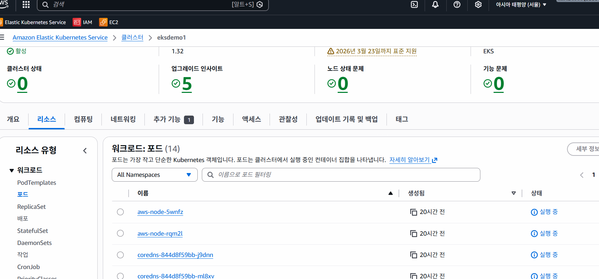
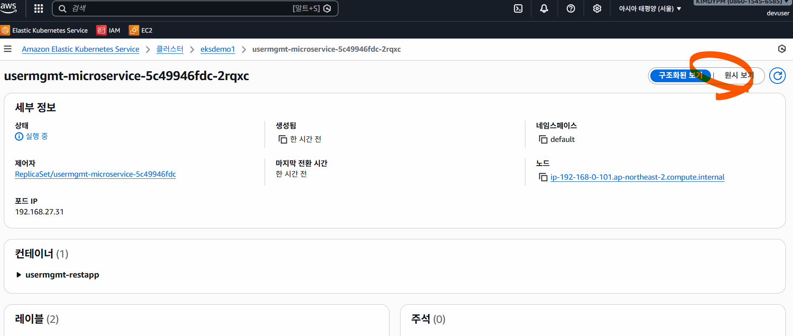
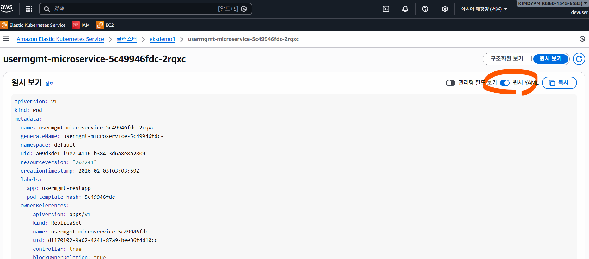
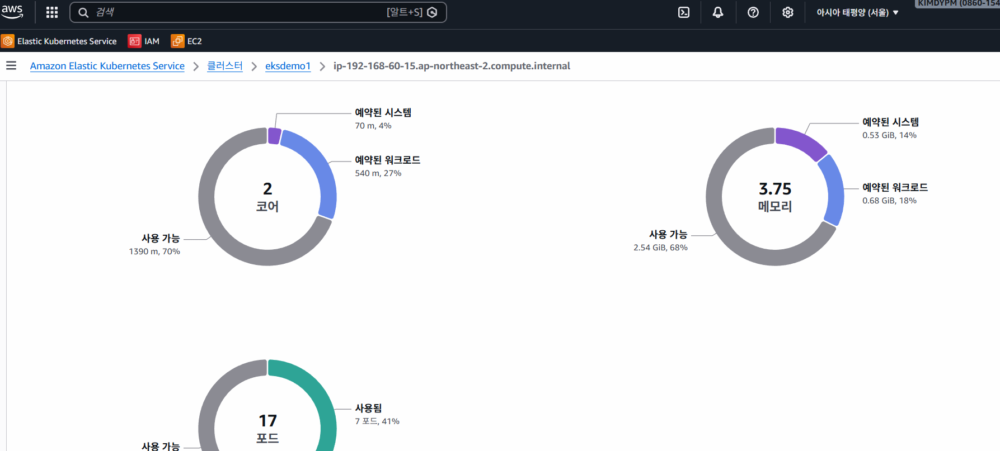
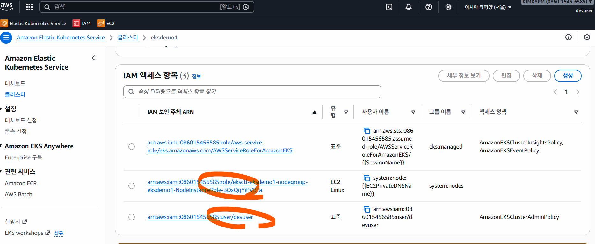

# AWS EKS 스토리지

## AWS EBS CSI 드라이버
- MySQL 데이터베이스의 영속 스토리지를 위해 EBS CSI 드라이버와 EBS 볼륨을 사용합니다.

## 주제
1. EBS CSI 드라이버 설치
2. MySQL 데이터베이스 디플로이먼트 및 ClusterIP 서비스 생성
3. 사용자 관리 마이크로서비스 디플로이먼트 및 NodePort 서비스 생성

## 개념
| Kubernetes 객체  | YAML 파일 |
| ------------- | ------------- |
| 스토리지 클래스  | 01-storage-class.yml |
| 퍼시스턴트 볼륨 클레임 | 02-persistent-volume-claim.yml   |
| ConfigMap  | 03-UserManagement-ConfigMap.yml  |
| Deployment, 환경 변수, Volumes, VolumeMounts  | 04-mysql-deployment.yml  |
| ClusterIP 서비스  | 05-mysql-clusterip-service.yml  |
| Deployment, 환경 변수  | 06-UserManagementMicroservice-Deployment.yml  |
| NodePort 서비스  | 07-UserManagement-Service.yml  |

## 참고 자료:
- **동적 볼륨 프로비저닝:** https://kubernetes.io/docs/concepts/storage/dynamic-provisioning/
- https://github.com/kubernetes-sigs/aws-ebs-csi-driver/tree/master/deploy/kubernetes/overlays/stable
- https://docs.aws.amazon.com/eks/latest/userguide/ebs-csi.html
- https://github.com/kubernetes-sigs/aws-ebs-csi-driver
- https://github.com/kubernetes-sigs/aws-ebs-csi-driver/tree/master/examples/kubernetes/dynamic-provisioning
- https://github.com/kubernetes-sigs/aws-ebs-csi-driver/tree/master/deploy/kubernetes/overlays/stable
- https://github.com/kubernetes-sigs/aws-ebs-csi-driver
- **레거시: 추후 사용 중단 예정** 
  - https://kubernetes.io/docs/concepts/storage/storage-classes/#aws-ebs
  - https://docs.aws.amazon.com/eks/latest/userguide/storage-classes.html

## AWS Console 에서 resource 확인

- root 가 아닌 aws configure 사용 계정으로 접속

- pod 의 json 내용 보기(k8s API 기능 그대로)

- yaml 형태로 보기, 차후 deploy yaml 로 사용하기 위한 백업 용도

- node 상태 보기 ( cpu , MM 등)

- 해당 사용 role , 계정 보기
